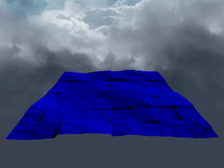

# FFT Water

Many video games,
for example, [PUBG](https://en.wikipedia.org/wiki/PlayerUnknown%27s_Battlegrounds),
[Uncharted 4](https://en.wikipedia.org/wiki/Uncharted_4:_A_Thief%27s_End),
and [Sea of Thieves](https://en.wikipedia.org/wiki/Sea_of_Thieves),
contain wide ocean scenes.
Those oceans move in realtime and have realistic appearance.
Basically, they are created using the well-known method proposed by [Tessendorf, 2001].

Tessendorf states that the height of wind-waves in the open ocean
can be decomposed into a sum of sine and cosine waves.
Given a set of frequencies and sampling points,
the height can be efficiently calculated using Fast Fourier Transform (FFT).
That's why I call it FFT water.

Technically, the method uses Inverse FFT, as it creates wave heights from frequencies.
But essentially, IFFT is same as FFT.
Their differences are just the coefficient and the conjugate exponent.

# About this project

[Keith Lantz](https://www.keithlantz.net/2011/10/ocean-simulation-part-one-using-the-discrete-fourier-transform/) has provided a nice implementation of [Tessendorf, 2001], and I use it as a start point.
The goal of this project is to create an ocean scene which I have seen in many video games.
It will have features as following:

- Realistic appearance: reflections, refractions, foams, caustics, etc.

- Can interact with objects (i.e. buoyancy).

- Everything works in real time.

- and so on.

# Tricks to reduce cost

There are `three` things to calculate each frame.

1. Height (`Eq. 19`). (`1` dimension, `1` IFFT)

2. Normal (`Eq. 20`). (`2` dimension, `2` IFFT)

3. Horizontal displacement (`Eq. 29`). (`2` dimension, `2` IFFT)

Normally, `5` IFFT are needed `per frame`,
as each equation has different frequency term.
However, given the number of sampling points `N` along each axis,
their complex exponent terms are always the same, i.e.


So it is better to calculate these exponents once before simulation,
and write them into a lookup table.
Then, access that table when performing IFFT in each frame.

# A specially designed IFFT

Using standard FFT codes (e.g. [Cooley–Tukey FFT](https://rosettacode.org/wiki/Fast_Fourier_transform#C.2B.2B)) results in incorrect geometry changes.
Generally, standard FFT assumes that the sampling position is non-negative.
However, the wave vectors used in [Tessendorf, 2001] have negative components.
This constraint guarantees the variety of wave directions.
For example, if a wave vector only has non-negative components,
its direction will always reside in `[+x, +z]` and `[-x, -z]` orthants, and hence,
waves with directions within `[-x, +z]` and `[+x, -z]` orthants are lost.

Furthermore, a standard FFT assumes that the range of summation is also non-negative.
Based on this constraint, it designs the complex exponent set and iterations.
However, the range used in [Tessendorf, 2001] is `[-N/2, N/2)`, with `N` representing the number of sampling points.
It means that a different set of complex exponents should be used.
Therefore, a special IFFT must be designed for [Tessendorf, 2001].

# Stormy effect

A stormy or calm ocean can be easily obtained using a scaling matrix.

```
mat4 newModel = scale(mat4(1.f), vec3(sx, sy, sz));
glUniformMatrix4fv(uniformOceanModel, 1, GL_FALSE, value_ptr(newModel));
glDrawArrays(GL_TRIANGLES, 0, nOfTriangles);
```

If the difference between the vertical scaling `sy`
and the horizontal scaling `(sx, xz)` is small,
we will have a stormy ocean.
Otherwise, we will have a relatively calm ocean.

# Result



I have modified [Keith Lantz's code](https://github.com/klantz81/ocean-simulation/tree/master/src) and it can be run on `OSX` now.

# Reference
[Tessendorf, 2001] Tessendorf, Jerry. "Simulating ocean water." Simulating nature: realistic and interactive techniques. SIGGRAPH 1.2 (2001): 5.
