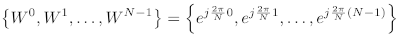
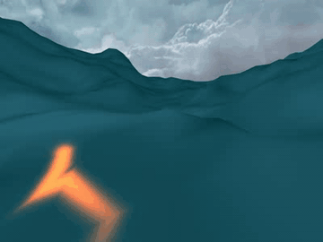

# FFT Water

Many video games,
for example, [PUBG](https://en.wikipedia.org/wiki/PlayerUnknown%27s_Battlegrounds),
[Uncharted 4](https://en.wikipedia.org/wiki/Uncharted_4:_A_Thief%27s_End),
and [Sea of Thieves](https://en.wikipedia.org/wiki/Sea_of_Thieves),
contain wide ocean scenes.
Those oceans move in realtime and have realistic appearance.
Basically, they are created using the well-known method proposed by [1].

The paper states that the height of wind-waves in the open ocean
can be decomposed into a sum of sine and cosine waves.
Given a set of frequencies and sampling points,
the height can be calculated using Discrete Fourier Transform (DFT).
And Fast Fourier Transform (FFT) is an efficient way to calculate DFT.
That's why I call it FFT Water.

Technically, the method uses Inverse FFT, as it creates wave heights from frequencies.
But essentially, IFFT is same as FFT.
Their differences are just the coefficient and the conjugate exponent.

# About this project

[Keith Lantz](https://www.keithlantz.net/2011/10/ocean-simulation-part-one-using-the-discrete-fourier-transform/) has provided a nice implementation of [1], and I use it as a start point.
The goal of this project is to create an ocean scene which I have seen in many video games.
It will have features as following:

-   Realistic appearance: reflections, refractions, foams, caustics, etc.

-   Can interact with objects (i.e. buoyancy).

-   Everything works in real time.

-   and so on.

# Tricks to reduce cost

There are `three` things to calculate each frame.

1.  Height (`Eq. 19`). (`1` dimension, `1` IFFT)

2.  Normal (`Eq. 20`). (`2` dimension, `2` IFFT)

3.  Horizontal displacement (`Eq. 29`). (`2` dimension, `2` IFFT)

Normally, `5` IFFT are needed `per frame`,
as each equation has different frequency term.
However, given the number of sampling points `N` along each axis,
their complex exponent terms are always the same, i.e.

So it is better to calculate these exponents once before simulation,
and write them into a lookup table.
Then, access that table when performing IFFT in each frame.

# A specially designed IFFT

Using standard FFT codes (e.g. [Cooley–Tukey FFT](https://rosettacode.org/wiki/Fast_Fourier_transform#C.2B.2B)) results in incorrect geometry changes.
Generally, standard FFT assumes that the sampling position is non-negative.
However, the wave vectors used in [1] have negative components.
This constraint guarantees the variety of wave directions.
For example, if a wave vector only has non-negative components,
its direction will always reside in `[+x, +z]` and `[-x, -z]` orthants, and hence,
waves with directions within `[-x, +z]` and `[+x, -z]` orthants are lost.

Furthermore, a standard FFT assumes that the range of summation is also non-negative.
Based on this constraint, it designs the complex exponent set and iterations.
However, the range used in [1] is `[-N/2, N/2)`, with `N` representing the number of sampling points.
It means that a different set of complex exponents should be used.
Therefore, a special IFFT must be designed for [1].

# Result

I have modified [Keith Lantz's code](https://github.com/klantz81/ocean-simulation/tree/master/src) and it can be run on `OSX` now.

## Level of Detail (LOD)

When rendering a wide ocean,
LOD is always a good choice to improve performance.

For each frame, first, render a height map, a xz-displacement map and a normal map [3].
Second, sampling those maps both in tessellation shader and fragment shader.

For example, in the demo, a 4-vertex quad is subdivided into a `64x64` grid based on the distance between `eyePoint` and a vertex.

The shading code is based on [4].

## Underwater

When the eye point is underwater, mix the frame with a blue-green color
to obtain an underwater effect.

This can be achieved by using the [post-processsing](https://en.wikibooks.org/wiki/OpenGL_Programming/Post-Processing) of OpenGL,
and `eyePoint.y < threshold` is used as the condition of underwater.

To avoid the artifact when `eyePoint.y` is near the ocean surface,
it is better to set a diving/rising area `[-someValue, someValue]`.
Always keep `eyePoint.y` outside of this area.
When diving or rising, quickly go through this area.
This strategy can make the artifact unnoticeable.

# Problem

Currently, the result (`512x512` FFT resolution) is not rendered in realtime.
A GPU-based parallelization is necessary for that purpose.

# Reference

[1] Tessendorf, Jerry. "Simulating ocean water." Simulating nature: realistic and interactive techniques. SIGGRAPH 1.2 (2001): 5.

[2] Ang, Nigel, et al. "The technical art of sea of thieves." ACM SIGGRAPH 2018 Talks. 2018. 1-2. ([link](https://dl.acm.org/doi/10.1145/3214745.3214820), including video)

[3] An introduction to Realistic Ocean Rendering through FFT - Fabio Suriano - Codemotion Rome 2017 ([slide](https://www.slideshare.net/Codemotion/an-introduction-to-realistic-ocean-rendering-through-fft-fabio-suriano-codemotion-rome-2017), [video](https://www.youtube.com/watch?v=ClW3fo94KR4))

[4] Claes, J. "Real-time water rendering-introducing the projected grid concept." Master's thesis (2004).
