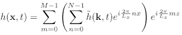
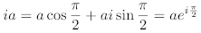

# FFT Water

Many video games,
for example, [PUBG](https://en.wikipedia.org/wiki/PlayerUnknown%27s_Battlegrounds),
[Uncharted 4](https://en.wikipedia.org/wiki/Uncharted_4:_A_Thief%27s_End),
and [Sea of Thieves](https://en.wikipedia.org/wiki/Sea_of_Thieves),
contain wide ocean scenes.
Those oceans move in realtime and have realistic appearance.
Basically, they are created using the well-known method proposed by [Tessendorf, 2001].

Tessendorf states that the height of wind-waves in the open ocean
can be decomposed into a sum of sine and cosine waves.
Given a set of frequencies and sampling points,
the height can be efficiently calculated using Fast Fourier Transform (FFT).
That's why I call it FFT water.

Technically, the method uses Inverse FFT, as it creates wave heights from frequencies.
But essentially, IFFT is same as FFT.
Their differences are just the coefficient and the conjugate exponent.

# About this project

This project is based on the paper [Tessendorf, 2001] and the code from [Scrawk](https://github.com/Scrawk/Phillips-Ocean).

Although Scrawk's implementation already has a nice result, some problems exist.

1. The ocean shows obvious artifacts when the viewer moves far away.

2. The shading method is not realistic enough.

3. It cannot create foam.

4. The ocean cannot interact with objects.

I will try to fix those problems and produce a better result.

# Update the geometry of the water

There are `three` things to calculate each frame.

1. Height (`Eq. 19`). (`1` dimension, `1` IFFT)

2. Normal (`Eq. 20`). (`2` dimension, `2` IFFT)

3. Horizontal displacement (`Eq. 29`). (`2` dimension, `2` IFFT)

Normally, `5` IFFT are needed `per frame`,
as each equation has different frequency term.
However, given the number of sampling points `N` along each axis,
their complex exponent terms are always the same, i.e.

So it is better to calculate these exponents once before simulation,
and write them into a lookup table.
Then, access that table when performing IFFT in each frame.
Scrawk has shown this optimization in his code.

# IFFT

To be more obvious, `Eq. 19` can be rewritten as following.

Note that:

- The grid size `(Lx, Lz)` is used in the exponent term,
instead of the number of sampling points `(N, M)`.

- Some IFFT routine has a `1/NM` coefficient on the right side.

- `Eq. 26` provides the frequency term.

`Eq. 19, 20` can also be rewritten in a similar way.
The additional complex term `ik` has the following property:

Using this property, `ik` can be multiplied with the frequency term.

## 2D IFFT

According to [this article](https://www.ft.unicamp.br/docentes/magic/khoros/html-dip/c5/s2/front-page.html), a 2D IFFT can be calculated with a two-step 1D IFFT.

Assume we have a 2D frequency term `F(u, v)`, then

- Perform IFFT on each row of `F(u, v)` to get `f(u, y)`.

- Perform IFFT on each column of `f(u, y)` to get `f(x, y)`.

# Reference
[Tessendorf, 2001] Tessendorf, Jerry. "Simulating ocean water." Simulating nature: realistic and interactive techniques. SIGGRAPH 1.2 (2001): 5.

[Cooley–Tukey FFT](https://rosettacode.org/wiki/Fast_Fourier_transform#C.2B.2B)
